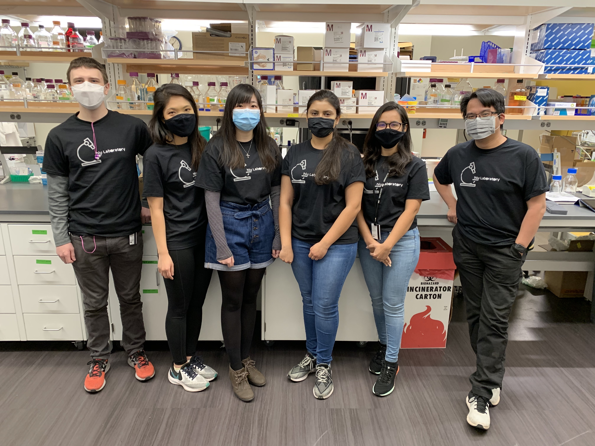

  

#### Po-Lin Chiu, Ph.D.
School of Molecular Sciences | CASD / The Biodesign Institute 
Arizona State University 

Office:  
&nbsp;&nbsp;&nbsp;&nbsp;&nbsp;1001 South McAllister Avenue 
&nbsp;&nbsp;&nbsp;&nbsp;&nbsp;Biodesign Building C377 
&nbsp;&nbsp;&nbsp;&nbsp;&nbsp;Tempe, Arizona 85287 
&nbsp;&nbsp;&nbsp;&nbsp;&nbsp;480.727.2058 
&nbsp;&nbsp;&nbsp;&nbsp;&nbsp;plchiu@asu.edu

Our lab is currently located in the Biodesign Building C388.  

Lab equipment: Ultracentrifuges, incubators for insect and mammalian cell culture, AKTÅ FPLC, AKTÅ Start, Shimazu UPLC system, voltage generator with oscilloscopes, and five GPU workstations for high-performance computing.  

TEM facility (Eyring Materials Center) (frequently accessed): one Thermo Fischer/FEI Vitrobot Mark IV automated plunger, one home-made manual plunger, one Philips CM12 TEM, two FEI Tecnai TF20 TEMs, one FEI aberration-corrected Environmental Titan TEM (K3/GIF), and one Thermo Fisher/FEI Titan Krios TEM (K2).  

Funding supports: DOE, Army, and Morphic Therapeutics. 

 

  <!---->
  
  <em>Masked 2020.</em>

 