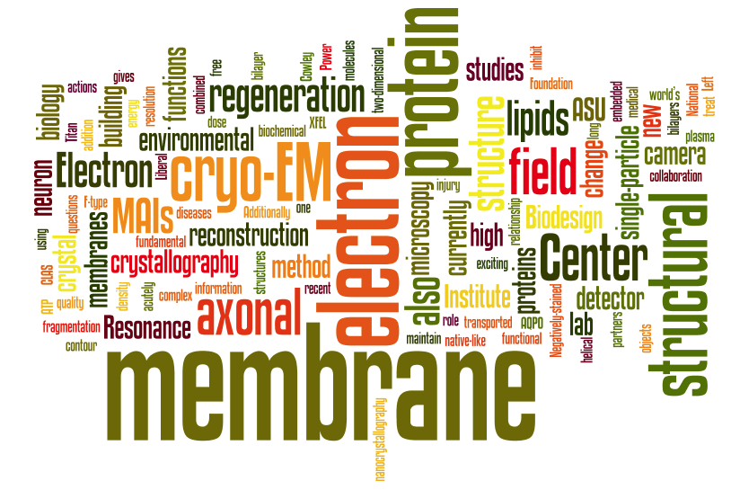

# Welcome to Cryo-EM Laboratory!

 

## Conferences and Meetings
- 09/09/2021 - 09/10/2021: [VCP Scientific Conference](https://hopin.com/events/vcp-scientific-conference-2021)
- 07/30/2021 - 08/05/2021: [ACA 2021 Structural Science Awakens](https://www.acameeting.com/call-for-papers-2021)
- 07/01/2021 - 07/02/2021: [PSB Symposium "Frontiers in Bioimaging"](https://www.esrf.fr/home/events/conferences/2021/psb-symposium-frontiers-in-bioimaging/call-for-abstracts-for-poster-and-oral-contributions.html)

 

 

## News
#### October 19, 2021
Chloe has just joined the Ph.D. club!  Also, welcome Saborni to join our group!

#### July 15, 2021
Back to in-person mode in the lab!

#### May 21, 2021
Lab Stack Overflow site is created.  https://stackoverflow.com/c/chiu-laboratory-asu/

#### March 19, 2019
Chloe passes the oral examination and becomes the Ph.D. candidate.
