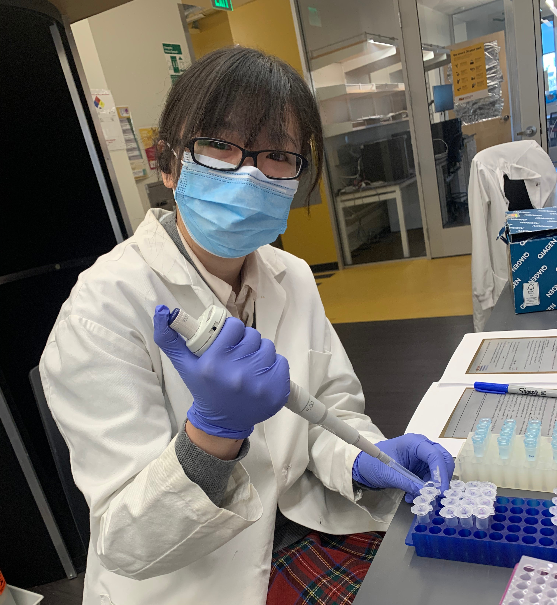
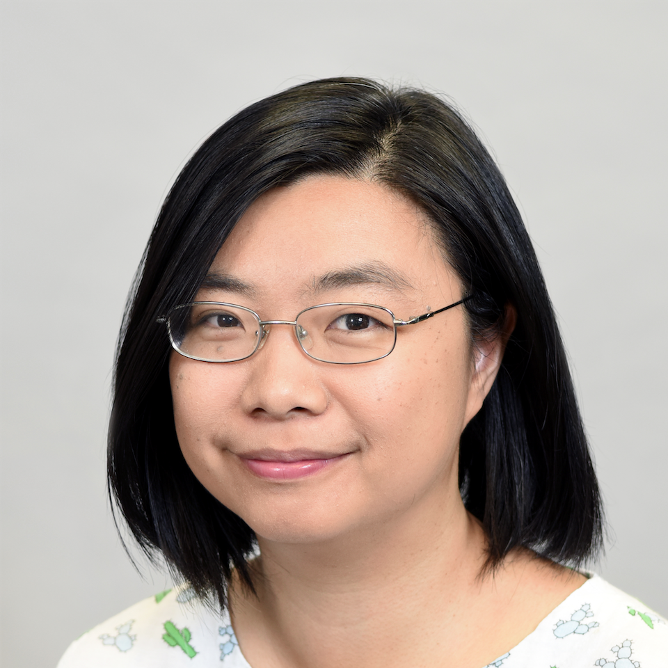
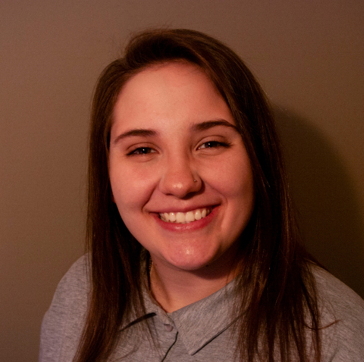
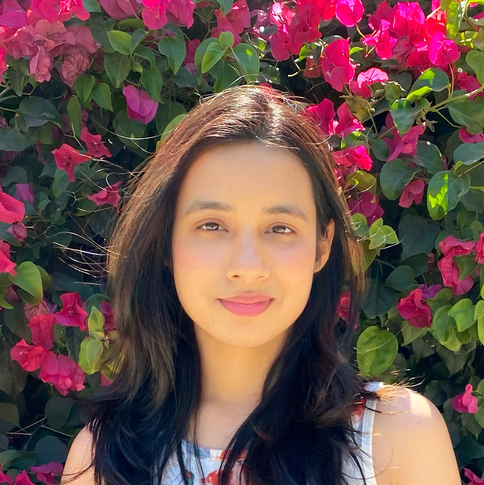
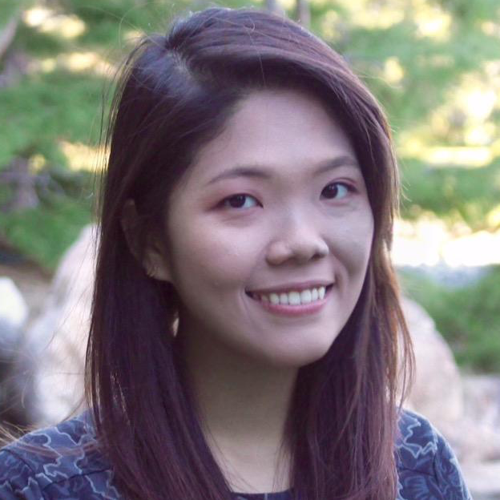

  

{:style="float: right; margin-left:10px; width:200px;"}

## Ka Yi (Tina) Chan

[kchan15@asu.edu](mailto:kchan15@asu.edu).

The Hong Kong Polytechnic University, Hong Kong, China. 
The Hong Kong Community College, Hong Kong, China. 

"regulated processing of p75 neurotrophin receptor"   

--------------------------------------------------------------------------------

  

{:style="float: right; margin-left:10px; width:200px;"}

## Po-Lin Chiu, Ph.D.

[plchiu@asu.edu](mailto:plchiu@asu.edu).

Assistant Professor of Molecular Sciences, Arizona State University, Tempe, AZ. 
Postdoctoral Fellow, Harvard Medical School, Boston, MA. 
Ph.D. Biophysics, University of California, Davis, CA. 
M.EE. Electrical Engineering, National Taiwan University, Taipei. 
B.Sc. Pharmacy, National Taiwan University, Taipei. 

 

--------------------------------------------------------------------------------

  

## Saborni Chowdhury

[schowd29@asu.edu](mailto:schowd29@asu.edu).

   

--------------------------------------------------------------------------------

  

## Kira Devore

[kira.devore@asu.edu](mailto:kira.devore@asu.edu).

B.Sc, Biochemistry, Arizona State University, Tempe, AZ. 

"p97-mediated membrane fusion"

   

--------------------------------------------------------------------------------

  

## Edgar Ferrer

[eferrer1@asu.edu](mailto:eferrer1@asu.edu).

B.Sc, Biochemistry, Arizona State University, Tempe, AZ.  

"p97-mediated membrane fusion"

   

--------------------------------------------------------------------------------

  

{:style="float: right; margin-left:10px; width:200px;"}

## Yu-Ping Poh, Ph.D.

[Yu-Ping.Poh@asu.edu](mailto:Yu-Ping.Poh@asu.edu).

Postdoctoral Fellow, Massachusetts Institute of Technology, Cambridge, MA. 
Postdoctoral Fellow, University of Massachusetts Medical School, Worcester, MA. 
Ph.D. Life Sciences, National Tsing-Hua University, Hsinchu. 
B.Sc. Life Sciences, National Tsing-Hua University, Hsinchu. 
   

--------------------------------------------------------------------------------

  

## Ryan Puskar

[rpuskar@asu.edu](mailto:rpuskar@asu.edu).

B.Sc. School of Molecular Sciences, Arizona State University, Tempe, AZ. 

"interaction between FMO and monolayer baseplate CsmA proteins"   

--------------------------------------------------------------------------------

  

{:style="float: right; margin-left:10px; width:200px;"}

## Elizabeth Rapacz

[elizabeth.rapacz@asu.edu](mailto:elizabeth.rapacz@asu.edu).

ASU undergraduate researcher. 

"regulated processing of p75 neurotrophin receptor"

--------------------------------------------------------------------------------

  

{:style="float: right; margin-left:10px; width:200px;"}

## Kazi Waheeda

[kwaheeda@asu.edu](mailto:kwaheeda@asu.edu).

MS Biochemistry, Calcutta University, Kolkata, West Bengal, India. 

"Rubisco/Rca complex"   

--------------------------------------------------------------------------------

# Past members

2022 Spring - Galilea Loza (Undergraduate) 
2022 Spring - Purbasha Nandi (Graduate) - Postdoc, Brookhaven National Lab, Upton, NY 
2021 Fall   - Du Chloe Truong (Graduate) - Rampant Biosciences 
2021 Fall   - Alan Nisanov (Undergraduate) - BCASD, ASU 
2020 Fall   - Isabella Breen (Graduate) 
2020 Summer - Kris Suping Zheng (Undergraduate) 
2019 Summer - Jay-How Yang (Postdoc) - BCASD, ASU 
2018 Summer - Sanna Naveed (Undergraduate) 
2018 Spring - Pushkar Desaraju (Graduate)- Software Developer Intern - Edupoint Educational Systems, LLC 

<!--- {:style="float: right; margin-left:10px; width:200px;"} -->
