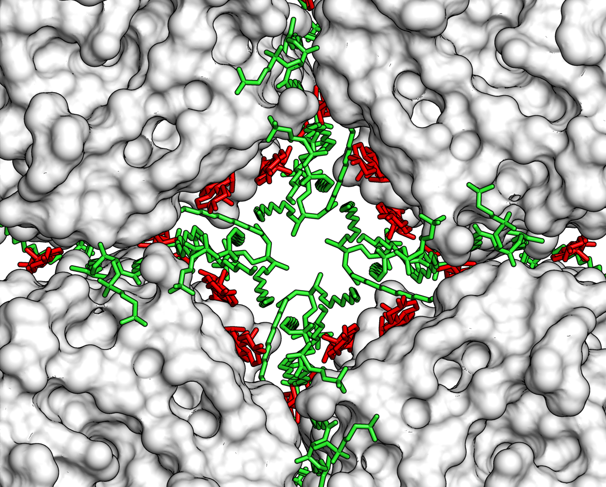

Membrane proteins act as gate keepers or signal transducers of the cell, which play an important role to maintain the basic cellular physiology in response to environmental change.  The location of the protein in the membrane is critical to  efficiently perform its function.  In our lab, we are interested in the **structures and functions of membrane proteins**, particularly the **interaction between lipids and proteins**.  We are tackling the fundamental questions about: 
  
  
- How does membrane protein sense the environmental change and respond? 
- How do membrane lipids spatially organize the proteins in the bilayer to perform their functions? 
- How does membrane protein interact with its partners, in the cytoplasmic side or embedded in the membrane, to carry out its task?   

We will use cryogenic electron microscopy (cryo-EM) method combined with biochemical approaches, such as nanodiscs technique, to probe the membrane protein structures in its native-like environment.  For structural determination, we will use **electron crystallography** (two-dimensional (2D) crystal specimens or helical objects) or **single-particle cryo-EM**.  In our lab, we initially focus on studying the receptor complex structure of the inhibitory signaling of axonal regeneration.  

When neuron encounters an axonal injury, the oligodendrocyte expresses the myelin-associated inhibitors (MAI) that are transported to the plasma membranes, and the exposed MAIs will inhibit the axonal regeneration of the affected neuron to maintain its plasticity.  These MAIs are also correlated with several immune actions.  To understand the structural information and the interactions between these MAIs and their receptors help us develop a medical strategy to treat the diseases related to the axonal regeneration, such as spinal cord injury and neurodegenerative diseases.  

In parallel, we are also interested in improving the cryo-EM method to increase the productivity and quality of structure determination.  Because of the newly developed direct detector, the image quality is boosted at both lower and higher resolutions, which allows us to utilize the data to reconstruct high-resolution 3D density map.  The cryo-EM sample preparation is still the hurdle of pursuing high-resolution structure determination.  Also, the strategies for the data and model refinement will require more robust algorithm if we incorporate high-resolution information of data.  We particularly focus in the areas of: 

- cryogenic specimen prepatation
- image correction of distorted phases and anisotropic magnification due to the applied defocus
- image classification of heterogeneous dataset
- model refinement 

