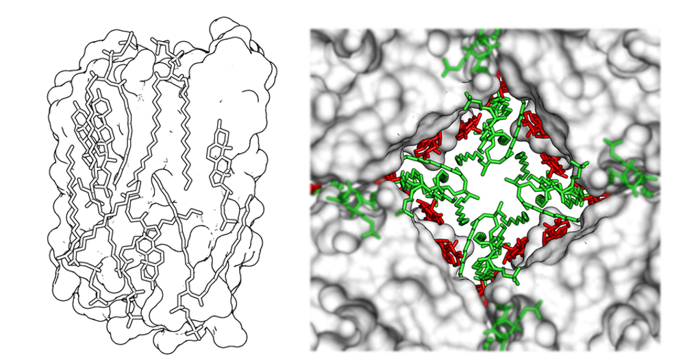
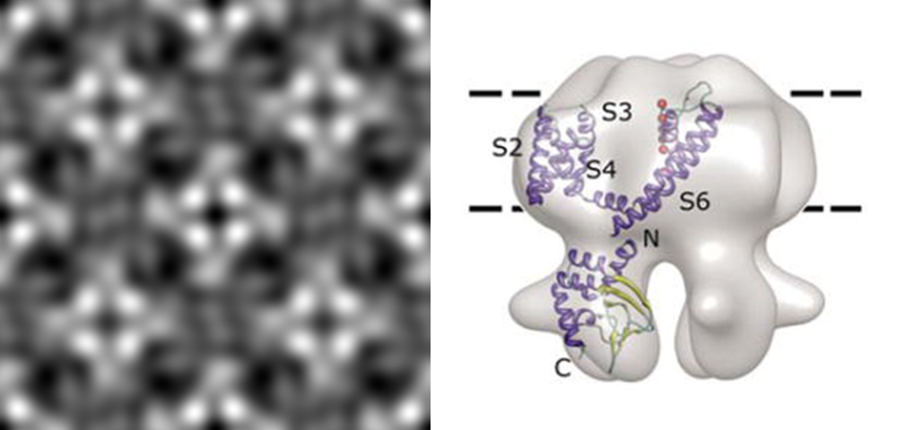
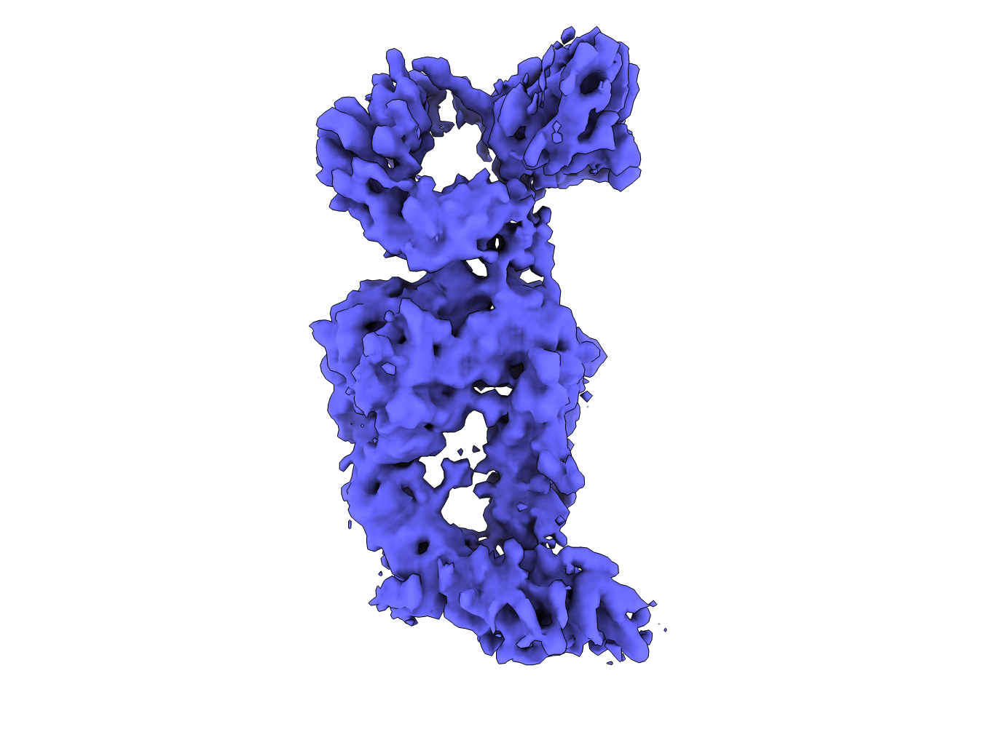
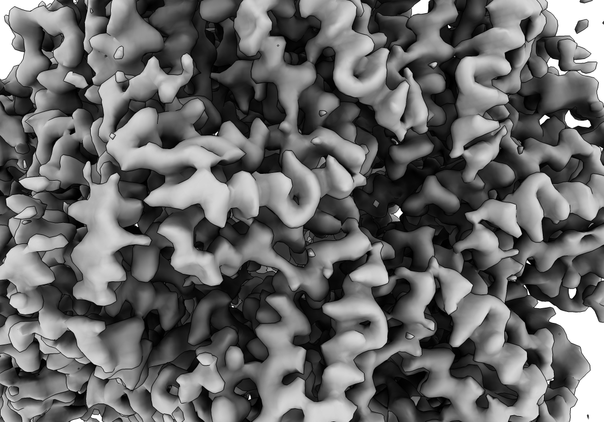

Our laboratory reseach focus on molecular mechanisms of bio-macromolecules, particularly membrane receptor complexes and energy-related machinery of biological systems.  The main tool we use to visualize the process is electron cryogenic microscopy (cryo-EM), including **electron crystallography** (two-dimensional (2D) crystal specimens or helical objects), **electron tomography** and **single-particle cryo-EM**.  In parallel, we are exploring new imaging and sample preparation methods to push the limits of cryo-EM use in biology.    

##### Membrane proteins
Membrane protein acts as a gate keeper or a diode in the cell membranes, which plays an important role in maintaining physiological processes in response to environmental changes.  Our lab interests are the **structures and functions of membrane proteins**, particularly in the context of membrane bilayers.  We are tackling the fundamental questions about:

- How does membrane protein sense the environmental change and respond in a functional or structural change?
- How do membrane lipids spatially organize the proteins in the bilayer to perform their functions?
- How does membrane protein interact with its partners, located in the cytoplasmic side or embedded in the membrane, to carry out its task?   

 

  
  <em>Aquaporin-0 (AQP0) with membrane lipids.</em>

 

 

  <!---->
  
  
  <em>Negatively-stained MloK1 revealed by electron crystallography and single-particle reconstruction.</em>

 

 

  
  <em>(A) Power spectrum and (B) IQ-plot of the AQP0/cholesterol 2D crystal image with its projectionn reconstruction in (C) grey and (D) contour representations.</em>

 

 

  <!---->
  
  <em>Schematic of the receptor complex of pro-NGF-p75NTR-sortilin.</em>

 

 

  <!---->
  
  <em>Cryo-EM density of an integrin complex.</em>

 

##### Energy-related molecular mechanisms
We are interested in how a cell produce or utilize energy to sustain its life.  Our research currently focus on the photosynthetic RC-FMO complex and ATP synthase motors.  We use both cryo-EM and molecular simulation methods to understand the energy transduction in the RC-FMO complex.  

 

  
  
  <em>Single-particle cryo-EM structure of an F-type ATP synthase (Left: F1 density; Right: transmembrane c-ring). </em>

 
 

  
  <em>Single-particle cryo-EM density of an ATPase.</em>

 

##### Electron imaging
We are exploring electron holographic imaging for the use in the measurements of single-particle physical properties.  We initially focus on the specimen of a polarized membrane. 

##### Research resources
Arizona State University (ASU) has a long history of international leadership in the field of electron microscopy. The Center for High Resolution Electron Microscopy, established as a National Science Foundation (NSF) Regional Center by Professor John M. Cowley in 1980, currently houses three aberration-corrected transmission electron microscopes (TEMs) and one Titan Krios TEM.  The existing resources for structural biology studies on the campus include the Magnetic Resonance Research Center (MRRC),  the College of Liberal Arts and Sciences (CLAS) Electron Paramagnetic Resonance (EPR), and the CLAS-EM Facility.  Additionally, ASU has pioneering research groups in the field of X-ray free electron lasers (XFEL) and femtosecond nanocrystallography.  The Center for Applied Structural Discovery (CASD) at the Biodesign Institute is currently building the world’s first high energy compact Free Electron Laser in collaboration with Massachusetts Institute of Technology, which will be hosted in the basement of the new Biodesign C building.  

